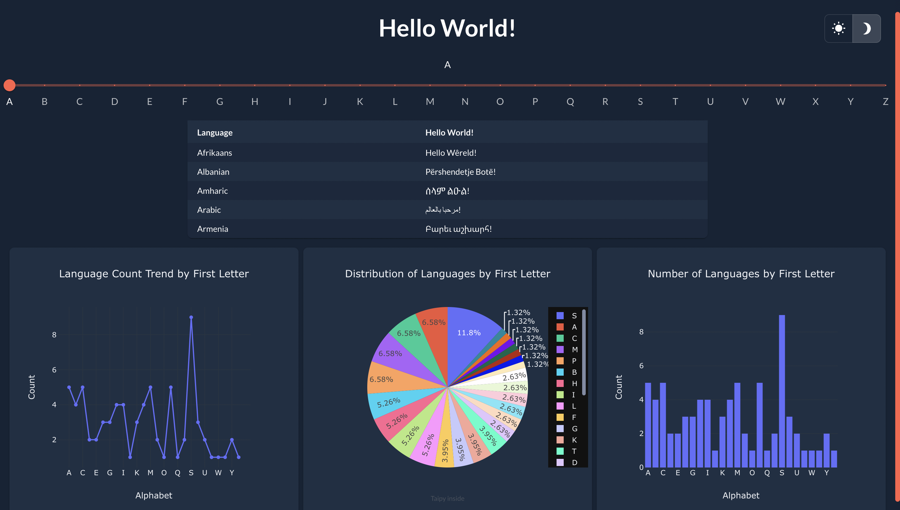

# hello-world

## Inspiration
The code was created for the MLH (Major League Hacking) challenge, specifically for the beginners week. Since it is my first attempt in any hackathon, I wanted to keep it simple but also use intimidating web development in some way.

## What it does
The code stores translation of 'Hello World!' in 76 languages used worldwide. The `taipy GUI` contains a slider to select first letter of language. Based on the selection, we see the list of languages starting with this letter and their corresponding translations of 'Hello World!'. To use graphs provided by `taipy`, there are also graphs showing interesting analysis of languages. 

## How we built it
Utilizing Python and leveraging the `taipy` library, we crafted a script that populates a dictionary with 'hello world' phrases in various languages. The GUI allows users to interactively explore these phrases and visualize language distribution based on their initial letters.

## Challenges we ran into
- Integrating the `taipy` library for GUI implementation, given that it was the first attempt using this tool.
- Structuring and organizing the code efficiently to manage language data and GUI elements.
- Handling data manipulation and visualization.
- Deploying application to Taipy cloud.

## Accomplishments that we're proud of
- Successfully implementing 'Hello World!' in numerous spoken languages, providing an educational and interactive tool.
- Overcoming the challenges of integrating a new library, `taipy`, and effectively using it for GUI development.
- Creating an aesthetically pleasing and functional interface for exploring language phrases.
- This fits into MLH's multiple categories:
  - Hello, World!
  - Finding and Using Libraries
  - Create a Useless Hack
  - Try an Intimidating Technology

## What we learned
- Familiarization with the `taipy` library for GUI development.
- Enhanced skills in data manipulation and visualization using `pandas` for diverse language sets.
- Problem-solving techniques when handling a large dataset within a graphical interface context.

## What's next for hello-world
- Using translator for any input text, not just 'Hello World!'
